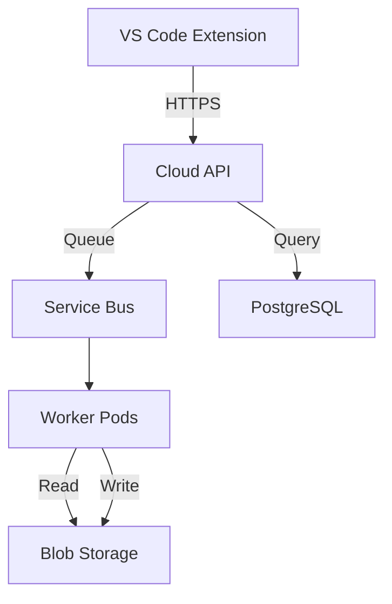

# Infrastructure as Code Standards

## Core Principle: Everything as Code

**All changeable components must be defined as code and deployed through automation.**

This applies to:
- **Infrastructure**: Cloud resources (Terraform)
- **Configuration**: App settings, feature flags (YAML/JSON)
- **Secrets**: References to secrets, not values (Key Vault)
- **Monitoring**: Alerts, dashboards (Prometheus/Grafana config)
- **Documentation**: Architecture, APIs (Markdown, OpenAPI)

**Why**: Reproducibility, auditability, version control, automation, disaster recovery.

---

## Terraform for Infrastructure

### State Management

**Never use local state in production.**

```hcl
# backend.tf
terraform {
  backend "azurerm" {
    resource_group_name  = "livecalc-terraform-state"
    storage_account_name = "livecalctfstate"
    container_name       = "tfstate"
    key                  = "prod.terraform.tfstate"
  }
}
```

**Requirements**:
- State stored in Azure Storage with encryption
- State locking enabled (prevents concurrent modifications)
- Separate state files per environment: `dev.tfstate`, `staging.tfstate`, `prod.tfstate`
- State file access restricted (only CI/CD pipeline and admins)

### Environment Separation

**Use workspaces or separate state files for environments.**

```hcl
# variables.tf
variable "environment" {
  description = "Environment name (dev, staging, prod)"
  type        = string
  validation {
    condition     = contains(["dev", "staging", "prod"], var.environment)
    error_message = "Environment must be dev, staging, or prod"
  }
}

# main.tf
resource "azurerm_kubernetes_cluster" "livecalc" {
  name                = "livecalc-${var.environment}"
  resource_group_name = azurerm_resource_group.livecalc.name
  location            = azurerm_resource_group.livecalc.location
  dns_prefix          = "livecalc-${var.environment}"

  default_node_pool {
    name       = "default"
    node_count = var.environment == "prod" ? 3 : 1
    vm_size    = var.environment == "prod" ? "Standard_D4s_v3" : "Standard_B2s"
  }

  tags = {
    Environment = var.environment
    ManagedBy   = "Terraform"
  }
}
```

### Modules for Reusability

**Create modules for common patterns.**

```
terraform/
├── modules/
│   ├── aks-cluster/
│   │   ├── main.tf
│   │   ├── variables.tf
│   │   └── outputs.tf
│   ├── storage-account/
│   │   ├── main.tf
│   │   ├── variables.tf
│   │   └── outputs.tf
│   └── service-bus/
│       ├── main.tf
│       ├── variables.tf
│       └── outputs.tf
├── environments/
│   ├── dev/
│   │   ├── main.tf
│   │   └── terraform.tfvars
│   ├── staging/
│   │   ├── main.tf
│   │   └── terraform.tfvars
│   └── prod/
│       ├── main.tf
│       └── terraform.tfvars
└── backend.tf
```

**Module example**:
```hcl
# modules/aks-cluster/main.tf
resource "azurerm_kubernetes_cluster" "this" {
  name                = var.cluster_name
  resource_group_name = var.resource_group_name
  location            = var.location
  dns_prefix          = var.dns_prefix

  default_node_pool {
    name       = "default"
    node_count = var.node_count
    vm_size    = var.vm_size
  }

  identity {
    type = "SystemAssigned"
  }

  tags = var.tags
}

# modules/aks-cluster/variables.tf
variable "cluster_name" {
  description = "Name of the AKS cluster"
  type        = string
}

variable "resource_group_name" {
  description = "Resource group for the cluster"
  type        = string
}

# ... more variables

# modules/aks-cluster/outputs.tf
output "cluster_id" {
  description = "AKS cluster ID"
  value       = azurerm_kubernetes_cluster.this.id
}

output "kubeconfig" {
  description = "Kubernetes config for kubectl"
  value       = azurerm_kubernetes_cluster.this.kube_config_raw
  sensitive   = true
}
```

**Usage**:
```hcl
# environments/prod/main.tf
module "aks_cluster" {
  source = "../../modules/aks-cluster"

  cluster_name        = "livecalc-prod"
  resource_group_name = azurerm_resource_group.livecalc.name
  location            = "uksouth"
  dns_prefix          = "livecalc-prod"
  node_count          = 3
  vm_size             = "Standard_D4s_v3"

  tags = {
    Environment = "prod"
    ManagedBy   = "Terraform"
  }
}
```

### Variables and Outputs

**Use variables for environment-specific values. Never hardcode.**

```hcl
# variables.tf
variable "environment" {
  type = string
}

variable "location" {
  description = "Azure region"
  type        = string
  default     = "uksouth"
}

variable "api_replicas" {
  description = "Number of API pod replicas"
  type        = number
  default     = 2
}

# terraform.tfvars (dev)
environment   = "dev"
location      = "uksouth"
api_replicas  = 1

# terraform.tfvars (prod)
environment   = "prod"
location      = "uksouth"
api_replicas  = 3
```

**Use outputs for values needed by other tools**:
```hcl
# outputs.tf
output "aks_cluster_name" {
  description = "AKS cluster name for kubectl config"
  value       = azurerm_kubernetes_cluster.livecalc.name
}

output "storage_account_key" {
  description = "Storage account key for Helm values"
  value       = azurerm_storage_account.livecalc.primary_access_key
  sensitive   = true
}

output "service_bus_connection_string" {
  description = "Service Bus connection string"
  value       = azurerm_servicebus_namespace.livecalc.default_primary_connection_string
  sensitive   = true
}
```

---

## Configuration Management

### Environment-Specific Config Files

```
helm/
├── Chart.yaml
├── values.yaml          # Default values
├── values-dev.yaml      # Dev overrides
├── values-staging.yaml  # Staging overrides
└── values-prod.yaml     # Production overrides
```

**values.yaml** (defaults):
```yaml
api:
  replicaCount: 2
  image:
    repository: livecalc/api
    tag: "latest"
  resources:
    requests:
      cpu: 500m
      memory: 512Mi
    limits:
      cpu: 1000m
      memory: 1Gi

database:
  host: localhost
  port: 5432
  name: livecalc
```

**values-prod.yaml** (overrides):
```yaml
api:
  replicaCount: 3
  image:
    tag: "1.2.3"  # Pinned version in prod
  resources:
    requests:
      cpu: 1000m
      memory: 2Gi
    limits:
      cpu: 2000m
      memory: 4Gi

database:
  host: livecalc-prod.postgres.database.azure.com
  port: 5432
  name: livecalc_prod
```

**Deployment**:
```bash
# Dev
helm upgrade --install livecalc ./helm \
  -f helm/values.yaml \
  -f helm/values-dev.yaml \
  --namespace livecalc-dev

# Prod
helm upgrade --install livecalc ./helm \
  -f helm/values.yaml \
  -f helm/values-prod.yaml \
  --namespace livecalc-prod
```

### Secrets Management

**Never inline secrets in config. Reference from Key Vault.**

```yaml
# Bad: Secrets in values file
database:
  username: admin
  password: SuperSecret123!

# Good: Reference to Key Vault
database:
  username: admin
  passwordSecretRef:
    name: livecalc-secrets
    key: db-password
```

**Kubernetes Secret from Key Vault**:
```yaml
# Using Azure Key Vault CSI driver
apiVersion: secrets-store.csi.x-k8s.io/v1
kind: SecretProviderClass
metadata:
  name: azure-keyvault
spec:
  provider: azure
  parameters:
    keyvaultName: "livecalc-keyvault"
    objects: |
      array:
        - |
          objectName: db-password
          objectType: secret
        - |
          objectName: storage-account-key
          objectType: secret
```

### Feature Flags

**Use config files, not environment variables, for feature flags.**

```yaml
# values.yaml
features:
  enableIntegrityChecks: false
  enableRemoteDebugging: true
  enableAnomalyDetection: false
  maxConcurrentJobs: 10

# values-prod.yaml
features:
  enableIntegrityChecks: true  # Enable in prod
  enableRemoteDebugging: false # Disable in prod (security)
  enableAnomalyDetection: true
  maxConcurrentJobs: 50
```

**Code usage**:
```python
from config import settings

if settings.features.enable_anomaly_detection:
    anomalies = detect_anomalies(results)
```

### Schema Validation

**Validate config files with JSON Schema.**

```yaml
# config.schema.json
{
  "$schema": "http://json-schema.org/draft-07/schema#",
  "type": "object",
  "required": ["api", "database"],
  "properties": {
    "api": {
      "type": "object",
      "required": ["replicaCount"],
      "properties": {
        "replicaCount": {
          "type": "integer",
          "minimum": 1,
          "maximum": 10
        }
      }
    }
  }
}
```

**Validation in CI**:
```bash
# GitHub Actions
- name: Validate Helm values
  run: |
    helm lint ./helm -f helm/values-prod.yaml
    jsonschema -i helm/values-prod.yaml config.schema.json
```

---

## Deployment Automation

### CI/CD Pipeline

**GitHub Actions for all deployments.**

```yaml
# .github/workflows/deploy.yml
name: Deploy to Production

on:
  push:
    tags:
      - 'v*'  # Trigger on version tags

jobs:
  deploy:
    runs-on: ubuntu-latest
    steps:
      - uses: actions/checkout@v3

      - name: Azure Login
        uses: azure/login@v1
        with:
          creds: ${{ secrets.AZURE_CREDENTIALS }}

      - name: Build Docker Image
        run: |
          docker build -t livecalc/api:${{ github.ref_name }} .
          docker push livecalc/api:${{ github.ref_name }}

      - name: Deploy with Helm
        run: |
          az aks get-credentials -n livecalc-prod -g livecalc-prod
          helm upgrade --install livecalc ./helm \
            -f helm/values-prod.yaml \
            --set api.image.tag=${{ github.ref_name }} \
            --namespace livecalc-prod \
            --wait
```

### Deployment Strategy

**Use rolling updates for zero downtime.**

```yaml
# Kubernetes Deployment
apiVersion: apps/v1
kind: Deployment
metadata:
  name: livecalc-api
spec:
  replicas: 3
  strategy:
    type: RollingUpdate
    rollingUpdate:
      maxUnavailable: 0  # Always maintain capacity
      maxSurge: 1        # One extra pod during update

  template:
    spec:
      containers:
        - name: api
          image: livecalc/api:1.2.3
          readinessProbe:
            httpGet:
              path: /health/ready
              port: 8000
            initialDelaySeconds: 10
            periodSeconds: 5
          livenessProbe:
            httpGet:
              path: /health/live
              port: 8000
            initialDelaySeconds: 30
            periodSeconds: 10
```

**Health checks**:
```python
# FastAPI health endpoints
@app.get("/health/live")
async def liveness():
    return {"status": "alive"}

@app.get("/health/ready")
async def readiness():
    # Check dependencies
    try:
        await db.execute("SELECT 1")
        await queue.ping()
        return {"status": "ready"}
    except Exception as e:
        raise HTTPException(503, f"Not ready: {e}")
```

---

## Immutable Infrastructure

### Replace, Don't Modify

**Never SSH into servers and make changes. Build new images instead.**

```bash
# Bad: SSH and modify
ssh user@server
sudo apt-get update
sudo apt-get install new-package
sudo systemctl restart app

# Good: Build new image
# Update Dockerfile
RUN apt-get update && apt-get install -y new-package

# Build and deploy
docker build -t livecalc/api:1.2.4 .
docker push livecalc/api:1.2.4
kubectl set image deployment/livecalc-api api=livecalc/api:1.2.4
```

### Container Images are Immutable

**Tag images with version, never update 'latest' in production.**

```yaml
# Bad: Mutable tag
image: livecalc/api:latest

# Good: Immutable tag
image: livecalc/api:1.2.3
```

**Tagging strategy**:
- **Git commit SHA**: `livecalc/api:a1b2c3d` (for CI)
- **Semantic version**: `livecalc/api:1.2.3` (for prod)
- **Environment tag**: `livecalc/api:1.2.3-prod` (optional)

---

## Version Control

### Everything in Git

**All code, config, and IaC must be in version control.**

```
livecalc/
├── .github/
│   └── workflows/       # CI/CD pipelines
├── terraform/           # Infrastructure as code
├── helm/                # Kubernetes manifests
├── livecalc-api/        # Application code
├── livecalc-worker/     # Worker code
├── docs/                # Documentation
└── README.md
```

**What NOT to commit**:
- Secrets (use Key Vault)
- Generated files (`build/`, `dist/`, `node_modules/`)
- Local config (`.env`, `.vscode/`)
- Binary artifacts (use artifact registry)

### Semantic Versioning

**Use semantic versioning for releases: MAJOR.MINOR.PATCH**

- **MAJOR**: Breaking changes (e.g., API v1 → v2)
- **MINOR**: New features, backward-compatible
- **PATCH**: Bug fixes, no new features

```bash
# Tag releases
git tag -a v1.2.3 -m "Release 1.2.3: Add anomaly detection"
git push origin v1.2.3
```

---

## Documentation as Code

### API Specifications

**OpenAPI specs in YAML, versioned with code.**

```yaml
# openapi.yaml
openapi: 3.0.0
info:
  title: LiveCalc Cloud API
  version: 1.2.3
paths:
  /v1/jobs:
    post:
      summary: Submit a new projection job
      # ... full spec
```

**Generate documentation**:
```bash
# Redoc or Swagger UI
docker run -p 8080:80 -e SPEC_URL=openapi.yaml redocly/redoc
```

**Validate in CI**:
```yaml
- name: Validate OpenAPI spec
  run: |
    npm install -g @stoplight/spectral-cli
    spectral lint openapi.yaml
```

### Architecture Diagrams

**Use text-based diagrams (Mermaid, PlantUML, ASCII) not binary images.**

```markdown
# Architecture


```

**Why**: Text-based diagrams version well, diff well, and can be auto-generated from code.

---

## Monitoring as Code

### Prometheus Rules

```yaml
# prometheus-rules.yaml
groups:
  - name: livecalc-api
    interval: 30s
    rules:
      - alert: HighErrorRate
        expr: |
          rate(livecalc_api_errors_total[5m]) > 0.05
        for: 5m
        labels:
          severity: critical
        annotations:
          summary: "API error rate above 5%"
          description: "{{ $value }} errors/sec in last 5 minutes"

      - alert: HighQueueDepth
        expr: livecalc_queue_depth > 200
        for: 10m
        labels:
          severity: warning
        annotations:
          summary: "Queue depth above 200"
```

### Grafana Dashboards

```json
{
  "dashboard": {
    "title": "LiveCalc API",
    "panels": [
      {
        "title": "Request Rate",
        "targets": [
          {
            "expr": "rate(livecalc_api_requests_total[5m])"
          }
        ]
      }
    ]
  }
}
```

**Deploy with Helm**:
```yaml
# values.yaml
grafana:
  dashboards:
    - configMapRef: livecalc-dashboards
```

---

## Infrastructure Checklist

Before creating infrastructure:

- [ ] Terraform code in `terraform/` directory
- [ ] State stored in Azure Storage (not local)
- [ ] Separate state per environment
- [ ] Variables for all environment-specific values
- [ ] Modules for reusable patterns
- [ ] Outputs for downstream tools
- [ ] Secrets in Key Vault (never in code)
- [ ] Config validation (JSON Schema)
- [ ] CI/CD pipeline (GitHub Actions)
- [ ] Rolling update strategy
- [ ] Health checks configured
- [ ] Monitoring rules defined
- [ ] Documentation updated

---

## References

- [Terraform Best Practices](https://www.terraform-best-practices.com/)
- [Azure Terraform Provider](https://registry.terraform.io/providers/hashicorp/azurerm/latest/docs)
- [Helm Best Practices](https://helm.sh/docs/chart_best_practices/)
- [12-Factor App](https://12factor.net/)
- [Infrastructure as Code Patterns](https://infrastructure-as-code.com/)
